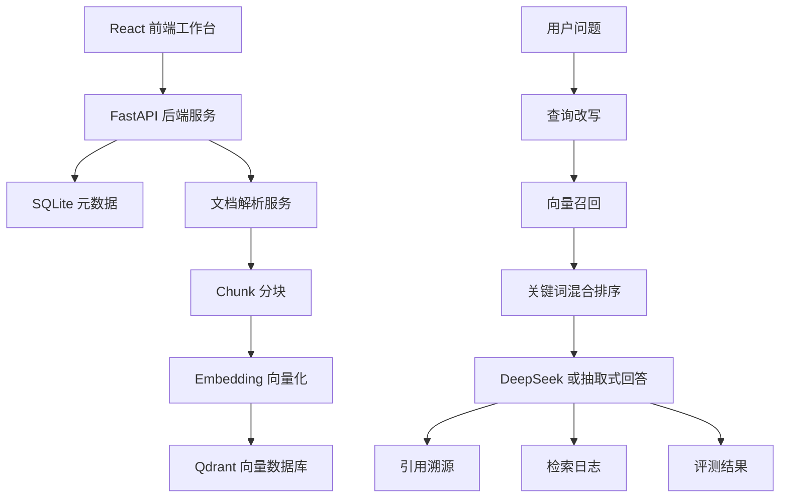
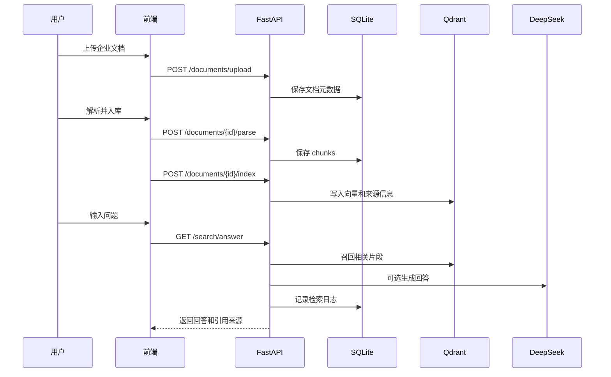

# 企业知识库 RAG 系统

一个面向企业内部知识问答场景的 RAG 应用，支持文档上传、解析分块、向量入库、混合检索、引用问答、检索日志和基础评测。项目参考 RAGFlow 的产品形态，但代码为独立实现，适合作为 AI 应用工程师 / 大模型应用工程师实习作品。


## 项目截图


## 项目背景

企业内部通常沉淀了大量制度文档、产品手册、技术文档、项目资料和合规材料。传统关键词搜索很难理解自然语言问题，而直接把文档交给大模型又容易出现回答无依据、上下文过长、结果不可追溯等问题。

本项目用 RAG 方式解决这个问题：先把企业文档解析成知识片段，再写入向量数据库；用户提问时先检索相关片段，再基于片段生成带引用的回答，最后记录检索日志并支持基础评测。

## 核心能力

- 文档上传：支持 PDF、TXT、Markdown、DOCX。
- 文档解析：提取正文内容，保留页码信息。
- Chunk 分块：把长文档切成适合检索的知识片段。
- 向量入库：将知识片段写入 Qdrant。
- 查询改写：对 AI、合规、隐私、幻觉等常见表达做轻量扩展。
- 混合检索：向量召回后结合关键词命中率重新排序。
- 引用问答：生成回答时展示引用编号、文档名、页码和原文片段。
- 模型降级：可选接入 DeepSeek；未配置密钥时使用抽取式回答兜底。
- 检索日志：记录问题、改写问题、回答、命中数和耗时。
- 基础评测：维护测试问题和期望关键词，运行后生成通过率。
- 权限保护：部署时可通过 `APP_API_KEY` 保护写操作接口。

## 技术栈

| 模块 | 技术 |
| --- | --- |
| 前端 | React、TypeScript、Vite |
| 后端 | FastAPI、Pydantic、SQLAlchemy |
| 文档解析 | pypdf、python-docx |
| 元数据存储 | SQLite |
| 向量数据库 | Qdrant |
| 大模型 | DeepSeek API，可选 |
| 部署 | Docker Compose |

## 技术架构



## 业务流程



## 代码结构

```text
enterprise-knowledge-rag
├── backend
│   ├── app
│   │   ├── api          # 文档、检索、评测、健康检查接口
│   │   ├── core         # 配置、文件存储、简单权限
│   │   ├── db           # SQLAlchemy 会话和初始化
│   │   ├── models       # 文档、分块、日志、评测数据模型
│   │   ├── schemas      # Pydantic 响应结构
│   │   └── services     # 文档解析、Embedding、向量库、RAG、LLM 客户端
│   └── tests            # RAG 核心逻辑自检
├── frontend
│   └── src              # React 工作台页面
├── docs
│   └── images           # 项目截图
└── docker-compose.yml
```

## 本地运行

### 1. 启动 Qdrant

```bash
docker compose up -d qdrant
```

### 2. 启动后端

```bash
cd backend
python -m venv .venv
.venv\Scripts\activate
pip install -r requirements.txt
uvicorn app.main:app --port 8002
```

### 3. 启动前端

```bash
cd frontend
npm install
npm run dev
```

访问地址：

- 前端：http://localhost:5173
- 后端：http://localhost:8002/api/health
- Qdrant：http://localhost:6333

## 环境变量

```env
APP_API_KEY=
DEEPSEEK_API_KEY=
DEEPSEEK_BASE_URL=https://api.deepseek.com
DEEPSEEK_MODEL=deepseek-chat
```

说明：

- `DEEPSEEK_API_KEY` 为空时，系统仍可运行，会使用抽取式回答。
- `APP_API_KEY` 为空时，本地开发不拦截写操作；部署时建议配置。

## 核心接口

| 方法 | 路径 | 说明 |
| --- | --- | --- |
| GET | `/api/health` | 后端健康检查 |
| POST | `/api/documents/upload` | 上传文档 |
| GET | `/api/documents` | 查询文档列表 |
| POST | `/api/documents/{id}/parse` | 解析文档并生成 chunks |
| GET | `/api/documents/{id}/chunks` | 查看文档分块 |
| POST | `/api/documents/{id}/index` | 写入向量数据库 |
| GET | `/api/search?query=...` | 召回相关片段 |
| GET | `/api/search/answer?query=...` | 生成带引用回答 |
| GET | `/api/search/logs` | 查看检索日志 |
| POST | `/api/evaluations/cases` | 新增评测用例 |
| POST | `/api/evaluations/cases/{id}/run` | 运行评测 |
| GET | `/api/evaluations/runs` | 查看评测结果 |

## 测试

```bash
cd backend
python tests/test_rag_services.py
```

前端构建：

```bash
cd frontend
npm run build
```

## 项目亮点

- 从开源 RAG 产品中拆解企业知识库核心需求，并独立复现主要工程链路。
- 实现从文档上传、解析、分块、入库到问答溯源的完整闭环。
- 引入查询改写和混合排序，改善只依赖向量相似度导致的召回不稳问题。
- 设计 DeepSeek 可选接入与抽取式回答降级，保证没有模型密钥时项目仍可演示。
- 增加检索日志和基础评测，为后续优化召回效果和回答质量提供数据基础。
- 保持前后端分离和 Docker 化依赖，便于本地运行、演示和后续部署。

## 简历描述

企业知识库 RAG 系统：基于 FastAPI、React、Qdrant 和 Docker 实现企业文档知识库问答应用，支持 PDF/DOCX 文档上传、解析分块、向量入库、查询改写、混合检索、引用溯源、检索日志和基础评测；设计 DeepSeek 可选接入与抽取式回答降级机制，提升系统可用性和回答可核查性。

## 后续优化

- 接入 BGE 或云厂商 Embedding 模型，替换当前轻量向量实现。
- 接入专业 Rerank 模型，替换当前关键词二次排序。
- 增加用户登录、角色权限和多租户隔离。
- 增加 Celery 或 Redis Queue 处理批量解析和入库任务。
- 增加 GitHub Actions，自动运行测试和前端构建。
- 部署到云服务器，并补充线上访问地址和演示截图。
