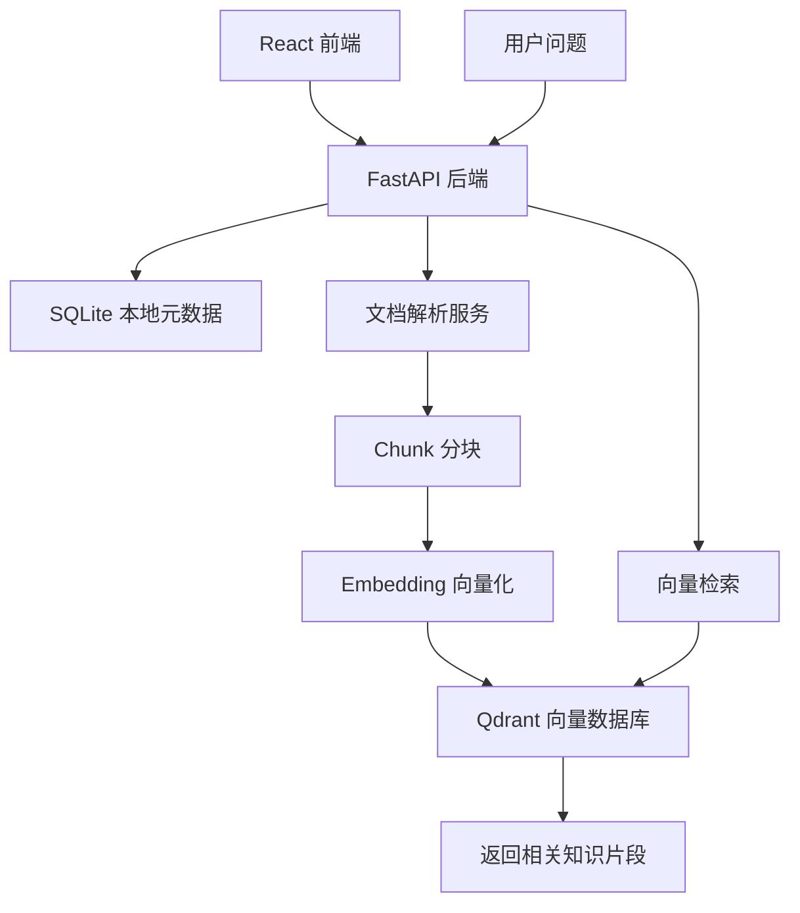
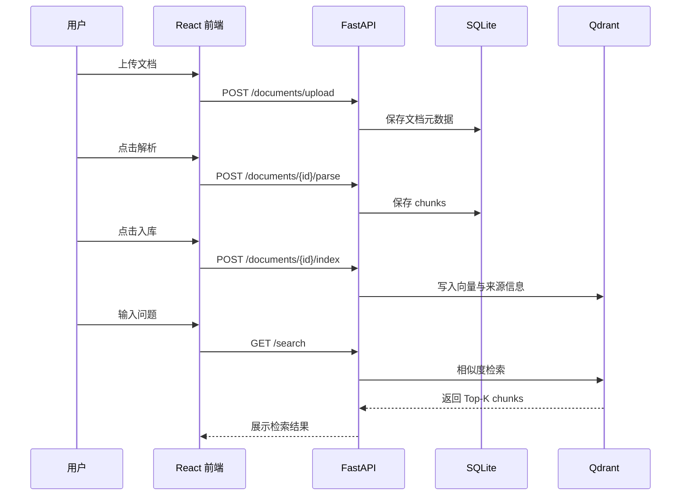

# Enterprise Knowledge RAG

面向企业知识库场景的轻量级 RAG 应用。项目参考 RAGFlow 的产品形态，独立实现文档上传、解析分块、向量入库和检索召回的基础流程，适合作为 AI 应用工程师实习项目继续迭代。


## 项目截图


## 项目背景

企业内部通常会有制度文档、产品手册、技术文档、项目资料等知识资产。传统关键词搜索很难处理自然语言问题，大模型直接回答又容易缺少依据。本项目尝试搭建一个可运行的企业知识库原型：先把文档解析成知识片段，再写入向量数据库，最后根据问题召回相关片段，为后续问答和引用溯源提供基础。

## 已实现功能

- 文档上传：支持 PDF、TXT、Markdown、DOCX
- 元数据管理：保存文件名、文件类型、大小、处理状态等信息
- 文档解析：提取文档文本内容
- Chunk 分块：将长文档切分为适合检索的知识片段
- 向量入库：将 chunk 写入 Qdrant 向量数据库
- 检索测试：输入问题后召回相关知识片段
- 前端页面：提供上传、解析、入库、查看 chunks、检索测试等操作入口
- 本地部署：提供 Docker Compose 和本地开发配置

## 技术架构



## 数据流程



## 技术栈

| 模块 | 技术 |
| --- | --- |
| 前端 | React, TypeScript, Vite |
| 后端 | FastAPI, Pydantic, SQLAlchemy |
| 文档解析 | pypdf, python-docx |
| 本地数据库 | SQLite |
| 向量数据库 | Qdrant |
| 部署 | Docker Compose |

## 本地运行

### 1. 启动 Qdrant

```bash
docker compose up -d qdrant
```

### 2. 启动后端

```bash
cd backend
python -m venv .venv
.venv\Scripts\activate
pip install -r requirements.txt
uvicorn app.main:app --port 8001
```

### 3. 启动前端

```bash
cd frontend
npm install
npm run dev
```

访问地址：

- 前端页面：http://localhost:5173
- 后端接口：http://localhost:8001/api/health
- Qdrant：http://localhost:6333

## API 列表

| 方法 | 路径 | 说明 |
| --- | --- | --- |
| GET | `/api/health` | 后端健康检查 |
| POST | `/api/documents/upload` | 上传文档 |
| GET | `/api/documents` | 查询文档列表 |
| POST | `/api/documents/{document_id}/parse` | 解析文档并生成 chunks |
| GET | `/api/documents/{document_id}/chunks` | 查看文档分块结果 |
| POST | `/api/documents/{document_id}/index` | 将 chunks 写入向量数据库 |
| GET | `/api/search?query=...` | 根据问题召回相关 chunks |

## 当前说明

当前版本重点验证 RAG 工程链路，因此 embedding 采用轻量实现，便于本地快速运行。后续可以替换为 BGE、text-embedding 等真实向量模型，并继续补充 Rerank、问答生成和引用溯源。

## 后续计划

- 接入真实 Embedding 模型
- 增加 Rerank 二次排序
- 接入 DeepSeek 问答生成
- 增加回答引用来源展示
- 增加多知识库管理
- 增加登录和权限控制
- 增加单元测试和接口文档
- 完善 Docker 一键部署

## 项目亮点

- 从开源企业知识库项目中拆解需求，并独立复现核心链路
- 覆盖文档处理、数据建模、向量数据库和前后端联调
- 代码结构清晰，适合作为 AI 应用工程项目继续扩展
- 具备后续升级为企业级 RAG 系统的空间
