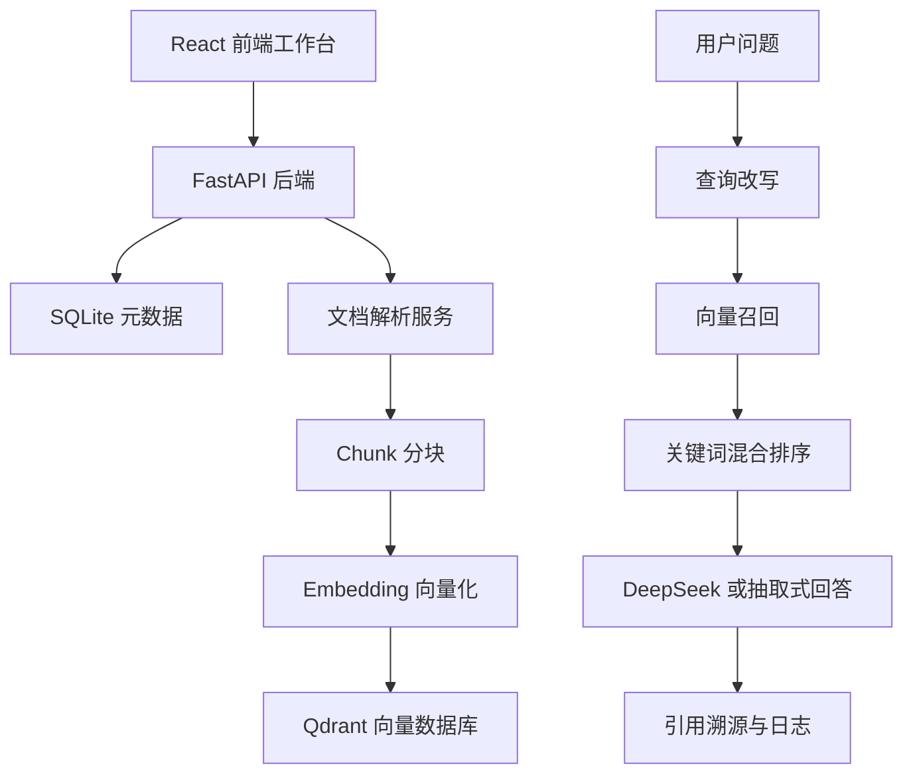

# 企业知识库 RAG 系统

面向企业内部制度、产品手册、技术文档和项目资料的知识库问答应用。项目参考 RAGFlow 的产品形态，独立实现文档上传、解析分块、向量入库、混合检索、查询改写、引用问答、检索日志和基础评测，适合作为 AI 应用工程师实习作品。


## 项目价值

企业使用大模型做内部知识问答时，常见问题是：文档多、检索慢、回答缺少依据、结果难以评估。本项目把 RAG 核心链路工程化：

- 文档解析后切成可检索的知识片段，避免整篇文档直接输入导致上下文混乱。
- 向量召回后结合关键词相似度二次排序，提高问题和片段的匹配度。
- 回答必须展示引用来源，便于用户核对原文，降低幻觉风险。
- 保存检索日志和评测用例，为后续优化召回率和回答质量提供依据。

## 已实现功能

- 文档上传：支持 PDF、TXT、Markdown、DOCX。
- 多知识库字段：文档可归属到不同知识库，非默认知识库支持检索过滤。
- 文档解析与分块：提取正文、按页保留页码、生成 chunk。
- 向量入库：将 chunk 写入 Qdrant，并保存文档名、页码、知识库等 payload。
- 查询改写：对常见中文业务词和 AI 缩写做轻量扩展。
- 混合检索：向量召回后结合关键词命中率计算综合分。
- 引用问答：可选接入 DeepSeek；无密钥时自动使用抽取式回答兜底。
- 引用溯源：回答展示引用编号、文档名、页码和原文片段。
- 检索日志：记录问题、改写后问题、回答、命中数量和耗时。
- 基础评测：维护问题和期望关键词，运行后生成通过率。
- 基础权限：部署时可通过 `APP_API_KEY` 保护上传、解析、入库、评测写操作。

## 技术架构



## 本地运行

### 1. 启动 Qdrant

```bash
docker compose up -d qdrant
```

### 2. 启动后端

```bash
cd backend
python -m venv .venv
.venv\Scripts\activate
pip install -r requirements.txt
uvicorn app.main:app --port 8002
```

### 3. 启动前端

```bash
cd frontend
npm install
npm run dev
```

访问地址：

- 前端：http://localhost:5173
- 后端健康检查：http://localhost:8002/api/health
- Qdrant：http://localhost:6333

## 可选环境变量

```env
APP_API_KEY=
DEEPSEEK_API_KEY=
DEEPSEEK_BASE_URL=https://api.deepseek.com
DEEPSEEK_MODEL=deepseek-chat
```

`DEEPSEEK_API_KEY` 不配置时，系统仍可运行，会使用抽取式回答作为兜底。

## 核心接口

| 方法 | 路径 | 说明 |
| --- | --- | --- |
| GET | `/api/health` | 健康检查 |
| POST | `/api/documents/upload` | 上传文档 |
| GET | `/api/documents` | 文档列表 |
| POST | `/api/documents/{id}/parse` | 解析并生成分块 |
| GET | `/api/documents/{id}/chunks` | 查看分块 |
| POST | `/api/documents/{id}/index` | 写入向量数据库 |
| GET | `/api/search?query=...` | 召回相关片段 |
| GET | `/api/search/answer?query=...` | 生成带引用回答 |
| GET | `/api/search/logs` | 查看检索日志 |
| POST | `/api/evaluations/cases` | 新增评测用例 |
| POST | `/api/evaluations/cases/{id}/run` | 运行评测 |

## 测试

```bash
cd backend
python tests/test_rag_services.py
```

## 简历描述

企业知识库 RAG 系统：基于 FastAPI、React、Qdrant 和 Docker 实现企业文档知识库问答应用，支持 PDF/DOCX 文档上传、解析分块、向量入库、查询改写、混合检索、引用溯源、检索日志和基础评测；设计 DeepSeek 可选接入与抽取式回答降级机制，提升系统可用性和回答可核查性。

## 后续优化

- 接入真实 BGE 或云厂商 Embedding 模型。
- 使用专业 Rerank 模型替换当前关键词二次排序。
- 增加用户登录、角色权限和多租户隔离。
- 增加批量文档处理队列和异步任务状态。
- 增加持续集成、单元测试和线上部署流水线。
